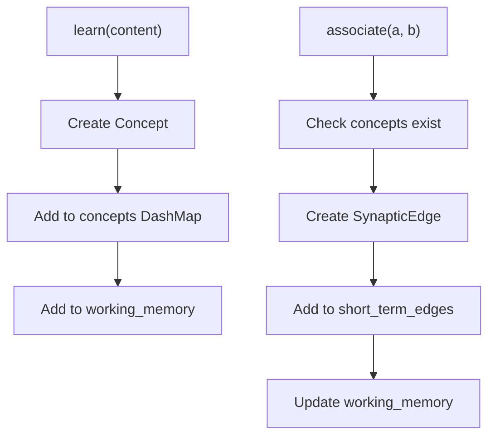
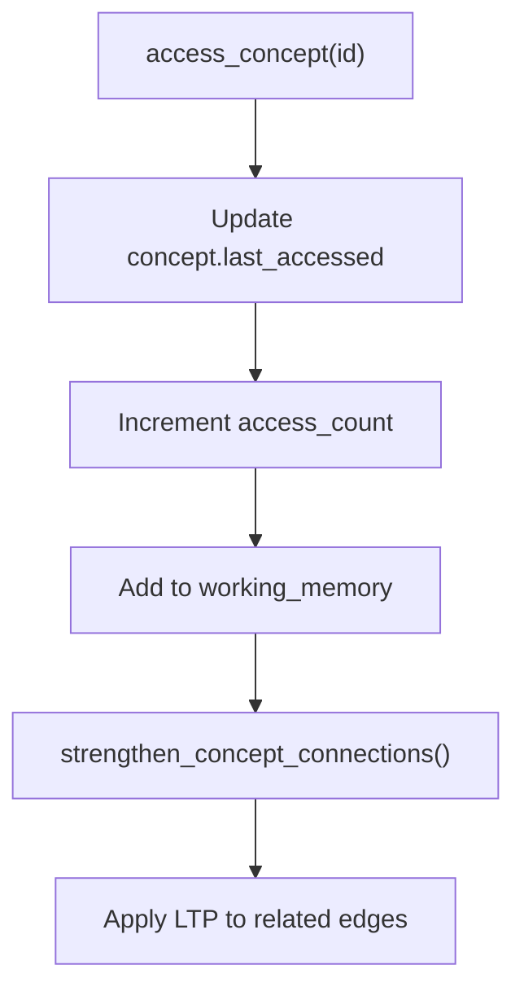
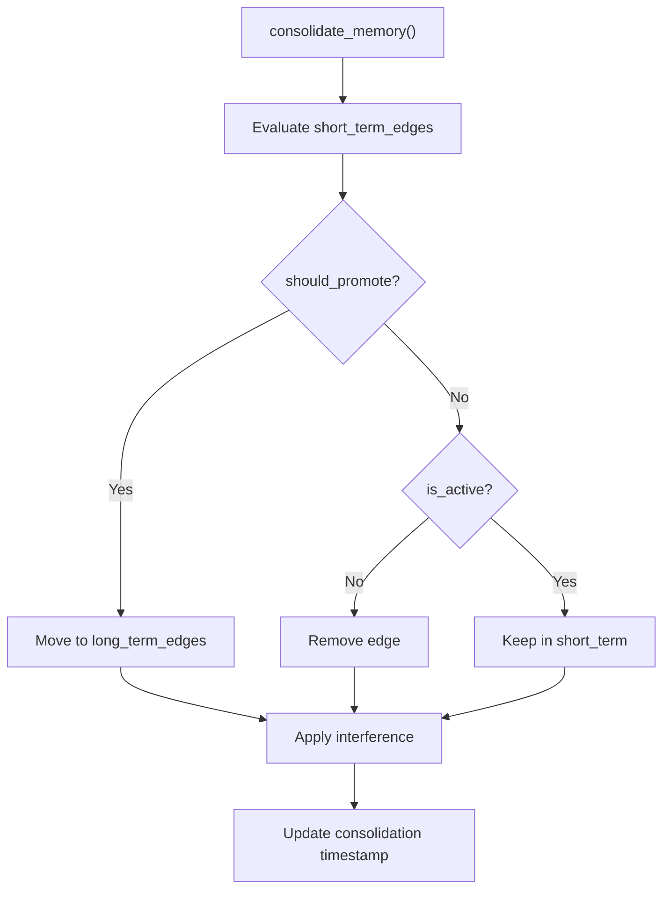
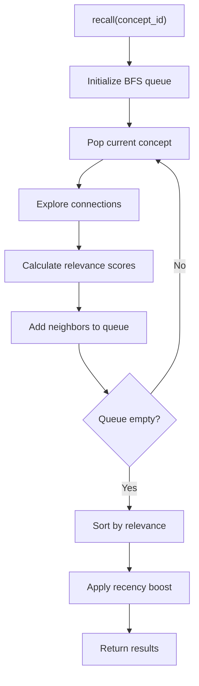

# 🏗️ LeafMind Architecture Guide

This document provides a deep dive into LeafMind's architecture, explaining the design decisions, patterns, and interactions between components.

## 🎯 Architectural Overview

LeafMind implements a **Neuromorphic Memory Architecture** that mimics biological memory systems. The design follows these key principles:

### Core Design Patterns

1. **Graph-Based Storage**: Concepts as nodes, relationships as weighted edges
2. **Zone-Based Memory**: Separate short-term and long-term storage areas
3. **Event-Driven Updates**: Memory changes trigger cascading updates
4. **Concurrent Access**: Thread-safe operations using lock-free data structures
5. **Configurable Behavior**: Tunable parameters for different use cases

## 🧠 Memory System Architecture

```
┌─────────────────────────────────────────────────────────┐
│                  LeafMind Memory System                 │
│                                                         │
│  ┌─────────────┐  ┌─────────────┐  ┌─────────────┐     │
│  │   Working   │  │ Short-Term  │  │ Long-Term   │     │
│  │   Memory    │  │   Memory    │  │   Memory    │     │
│  │             │  │             │  │             │     │
│  │ Active      │  │ Hippocampus │  │  Cortex     │     │
│  │ Concepts    │  │ Temporary   │  │ Permanent   │     │
│  │             │  │ Storage     │  │ Storage     │     │
│  └─────────────┘  └─────────────┘  └─────────────┘     │
│         │               │               │               │
│         └───────────────┼───────────────┘               │
│                         │                               │
│              ┌─────────────────────┐                    │
│              │   Consolidation     │                    │
│              │   Engine            │                    │
│              └─────────────────────┘                    │
└─────────────────────────────────────────────────────────┘
```

### Memory Zones Explained

#### 1. Working Memory (`working_memory: DashMap<ConceptId, DateTime<Utc>>`)

**Purpose**: Track currently active concepts
**Biological Inspiration**: Prefrontal cortex activity
**Implementation**: Simple timestamp tracking

```rust
// When a concept is accessed
self.working_memory.insert(concept_id.clone(), Utc::now());

// Cleanup old entries during sleep cycle
let cutoff_time = Utc::now() - Duration::hours(1);
// Remove entries older than cutoff
```

**Usage Patterns**:
- Added during `access_concept()`
- Used in `apply_ltp_strengthening()` for boosted learning
- Cleaned up during `sleep_cycle()`

#### 2. Short-Term Memory (`short_term_edges: DashMap<(ConceptId, ConceptId), SynapticEdge>`)

**Purpose**: Temporary storage for new associations
**Biological Inspiration**: Hippocampus
**Implementation**: Hash map of concept pairs to edges

```rust
// New associations start here
self.short_term_edges.insert((from, to), SynapticEdge::new(from, to));

// Promotion to long-term based on criteria
if self.should_promote_to_long_term(&edge) {
    self.long_term_edges.insert(key, edge);
    self.short_term_edges.remove(&key);
}
```

**Key Properties**:
- Fast insertion and access
- Subject to aggressive pruning
- Source for consolidation

#### 3. Long-Term Memory (`long_term_edges: DashMap<(ConceptId, ConceptId), SynapticEdge>`)

**Purpose**: Permanent storage for important associations
**Biological Inspiration**: Neocortex
**Implementation**: Same structure as short-term but different lifecycle

```rust
// Slower decay rate for stability
let long_term_decay_rate = self.config.decay_rate * 0.1;

// More resistant to forgetting
if edge.weight.value() < (threshold * 0.5) { // Lower threshold
    // Remove only very weak connections
}
```

**Key Properties**:
- Slower decay rates
- Higher resistance to forgetting
- Target of consolidation process

## 🔄 Data Flow Architecture

### 1. Learning Flow



### 2. Access Flow



### 3. Consolidation Flow



### 4. Recall Flow



## 🧬 Component Interactions

### 1. Cross-Module Dependencies

```rust
// memory_graph.rs - Core hub that other modules extend
impl MemoryGraph {
    // Basic operations
    pub fn learn(&self, content: String) -> ConceptId { ... }
    pub fn associate(&self, from: ConceptId, to: ConceptId) -> Result<(), String> { ... }
}

// plasticity.rs - Extends MemoryGraph with learning algorithms
impl MemoryGraph {
    pub fn apply_ltp_strengthening(&self) { ... }
    pub fn apply_ltd_decay(&self) { ... }
    pub fn hebbian_strengthening(&self, concepts: &[ConceptId]) { ... }
}

// consolidation.rs - Extends MemoryGraph with memory transfer
impl MemoryGraph {
    pub fn consolidate_memory(&self) -> ConsolidationStats { ... }
    pub fn reconsolidate(&self, concepts: &[ConceptId]) { ... }
}

// recall.rs - Extends MemoryGraph with retrieval methods
impl MemoryGraph {
    pub fn recall(&self, concept: &ConceptId, query: RecallQuery) -> Vec<RecallResult> { ... }
    pub fn recall_by_content(&self, content: &str, query: RecallQuery) -> Vec<RecallResult> { ... }
}

// forgetting.rs - Extends MemoryGraph with cleanup methods
impl MemoryGraph {
    pub fn forget(&self, config: ForgettingConfig) -> ForgettingStats { ... }
    pub fn forget_concepts(&self, concepts: &[ConceptId]) -> usize { ... }
}
```

### 2. Thread Safety Architecture

LeafMind uses **DashMap** for all concurrent collections:

```rust
use dashmap::DashMap;

pub struct MemoryGraph {
    // Thread-safe hash maps
    pub(crate) concepts: DashMap<ConceptId, Concept>,
    pub(crate) short_term_edges: DashMap<(ConceptId, ConceptId), SynapticEdge>,
    pub(crate) long_term_edges: DashMap<(ConceptId, ConceptId), SynapticEdge>,
    pub(crate) working_memory: DashMap<ConceptId, DateTime<Utc>>,
    
    // Thread-safe configuration
    pub(crate) config: MemoryConfig, // Read-only after creation
    pub(crate) last_consolidation: Arc<RwLock<DateTime<Utc>>>,
}
```

**Benefits**:
- Lock-free reads in most cases
- Concurrent modifications without blocking
- Automatic memory management
- High performance under contention

**Access Patterns**:
```rust
// Safe concurrent iteration
for edge_ref in self.short_term_edges.iter() {
    let edge = edge_ref.value(); // Gets a reference
    // Process edge
}

// Safe concurrent modification
for mut edge_ref in self.short_term_edges.iter_mut() {
    edge_ref.activate(learning_rate); // Modifies in place
}

// Safe insertion/removal
self.short_term_edges.insert(key, edge);
self.short_term_edges.remove(&key);
```

## ⚡ Performance Architecture

### 1. Algorithmic Complexity

| Operation | Time Complexity | Space Complexity | Notes |
|-----------|----------------|------------------|-------|
| `learn()` | O(1) | O(1) | Hash map insertion |
| `associate()` | O(1) | O(1) | Hash map insertion |
| `access_concept()` | O(d) | O(1) | d = degree of concept |
| `recall()` | O(k × d × log n) | O(n) | k = path length, d = avg degree |
| `consolidate()` | O(n) | O(1) | n = short-term edges |
| `forget()` | O(n) | O(1) | n = total edges |

### 2. Memory Layout Optimization

```rust
// Efficient edge key using tuple
type EdgeKey = (ConceptId, ConceptId);

// ConceptId uses UUID for unique, distributed IDs
#[derive(Debug, Clone, Serialize, Deserialize, PartialEq, Eq, Hash)]
pub struct ConceptId(pub Uuid);

// SynapticWeight is a newtype for type safety and optimization
#[derive(Debug, Clone, Copy, Serialize, Deserialize, PartialOrd, PartialEq)]
pub struct SynapticWeight(pub f64);
```

### 3. Caching Strategy

```rust
// Working memory acts as an access cache
pub(crate) working_memory: DashMap<ConceptId, DateTime<Utc>>,

// Concepts cache their access patterns
pub struct Concept {
    pub access_count: u64,        // Frequency cache
    pub last_accessed: DateTime<Utc>, // Recency cache
}

// Edges cache their activation patterns
pub struct SynapticEdge {
    pub activation_count: u64,    // Usage frequency
    pub last_accessed: DateTime<Utc>, // Last activation
}
```

## 🔧 Configuration Architecture

```rust
#[derive(Debug, Clone, Serialize, Deserialize)]
pub struct MemoryConfig {
    // Learning parameters
    pub learning_rate: f64,        // LTP strength (0.0-1.0)
    pub decay_rate: f64,           // LTD rate (0.0-1.0)
    
    // Consolidation parameters
    pub consolidation_threshold: f64,     // Promotion threshold
    pub consolidation_interval_hours: u64, // Sleep cycle frequency
    
    // Capacity limits
    pub max_short_term_connections: usize,
    pub max_recall_results: usize,
}

impl Default for MemoryConfig {
    fn default() -> Self {
        Self {
            learning_rate: 0.1,           // 10% boost per activation
            decay_rate: 0.01,             // 1% decay per cycle
            consolidation_threshold: 0.5,  // 50% strength for promotion
            max_short_term_connections: 10000,
            consolidation_interval_hours: 24, // Daily consolidation
            max_recall_results: 20,
        }
    }
}
```

### Configuration Usage Patterns

```rust
// Algorithm behavior adaptation
let adaptive_rate = self.adaptive_learning_rate(current_weight);
edge.activate(adaptive_rate * self.config.learning_rate);

// Capacity management
if self.short_term_edges.len() > self.config.max_short_term_connections {
    self.force_consolidation();
}

// Timing control
if self.should_consolidate() { // Uses consolidation_interval_hours
    self.consolidate_memory();
}
```

## 🎛️ Extension Points

### 1. New Memory Zones

```rust
// Add to MemoryGraph
pub struct MemoryGraph {
    // Existing zones...
    pub(crate) your_new_zone: DashMap<ConceptId, YourDataType>,
}

// Implement zone-specific operations
impl MemoryGraph {
    pub fn transfer_to_your_zone(&self, concept_id: ConceptId) {
        // Transfer logic
    }
    
    pub fn your_zone_specific_operation(&self) {
        // Zone operations
    }
}
```

### 2. New Plasticity Rules

```rust
// Add to plasticity.rs
impl MemoryGraph {
    pub fn your_plasticity_rule(&self, parameters: YourParams) {
        for mut edge in self.short_term_edges.iter_mut() {
            // Apply your learning rule
            let weight_change = your_algorithm(&edge, &parameters);
            edge.weight = SynapticWeight::new(edge.weight.value() + weight_change);
        }
    }
}
```

### 3. New Recall Algorithms

```rust
// Add to recall.rs
impl MemoryGraph {
    pub fn your_recall_method(&self, query: YourQuery) -> Vec<RecallResult> {
        let mut results = Vec::new();
        
        // Your retrieval algorithm
        for concept_ref in self.concepts.iter() {
            let relevance = your_relevance_function(concept_ref.value(), &query);
            if relevance > query.threshold {
                results.push(RecallResult {
                    concept: concept_ref.value().clone(),
                    relevance_score: relevance,
                    // ... other fields
                });
            }
        }
        
        results.sort_by(|a, b| b.relevance_score.partial_cmp(&a.relevance_score).unwrap());
        results
    }
}
```

## 🚀 Deployment Architecture

### 1. Library Structure

```rust
// lib.rs - Public API
pub use types::{Concept, ConceptId, MemoryConfig, SynapticWeight};
pub use memory_graph::{MemoryGraph, MemoryStats};
pub use recall::{RecallQuery, RecallResult};
pub use consolidation::ConsolidationStats;
pub use forgetting::{ForgettingConfig, ForgettingStats};
```

### 2. Error Handling Strategy

```rust
// Custom error types for different failure modes
#[derive(Debug)]
pub enum MemoryError {
    ConceptNotFound(ConceptId),
    InvalidWeight(f64),
    ConsolidationFailed(String),
    ConfigurationError(String),
}

// Result types for operations that can fail
pub type MemoryResult<T> = Result<T, MemoryError>;

// Usage in API
impl MemoryGraph {
    pub fn associate(&self, from: ConceptId, to: ConceptId) -> MemoryResult<()> {
        if !self.concepts.contains_key(&from) {
            return Err(MemoryError::ConceptNotFound(from));
        }
        // ... rest of implementation
        Ok(())
    }
}
```

### 3. Monitoring and Observability

```rust
use tracing::{debug, info, trace, warn, instrument};

impl MemoryGraph {
    #[instrument(skip(self), fields(concept_count = self.concepts.len()))]
    pub fn consolidate_memory(&self) -> ConsolidationStats {
        info!("Starting memory consolidation");
        
        let start_time = std::time::Instant::now();
        // ... consolidation logic
        let duration = start_time.elapsed();
        
        info!("Consolidation completed in {:?}", duration);
        stats
    }
}
```

## 📊 Metrics and Analytics

### 1. Built-in Statistics

```rust
pub struct MemoryStats {
    pub total_concepts: usize,
    pub short_term_connections: usize,
    pub long_term_connections: usize,
    pub working_memory_size: usize,
    pub last_consolidation: DateTime<Utc>,
}

// Advanced metrics
pub struct DetailedStats {
    pub memory_stats: MemoryStats,
    pub average_connection_strength: f64,
    pub most_connected_concepts: Vec<(ConceptId, usize)>,
    pub consolidation_efficiency: f64,
    pub forgetting_rate: f64,
}
```

### 2. Performance Profiling

```rust
// Add performance counters
pub struct PerformanceCounters {
    pub recall_operations: AtomicU64,
    pub consolidation_operations: AtomicU64,
    pub total_recall_time_ms: AtomicU64,
    pub total_consolidation_time_ms: AtomicU64,
}

// Usage
let start = std::time::Instant::now();
let results = self.recall(concept_id, query);
let duration = start.elapsed();
self.counters.total_recall_time_ms.fetch_add(duration.as_millis() as u64, Ordering::Relaxed);
self.counters.recall_operations.fetch_add(1, Ordering::Relaxed);
```

This architecture provides a solid foundation for understanding and extending LeafMind's neuromorphic memory system. Each component is designed to be modular, performant, and biologically inspired while maintaining clean separation of concerns.