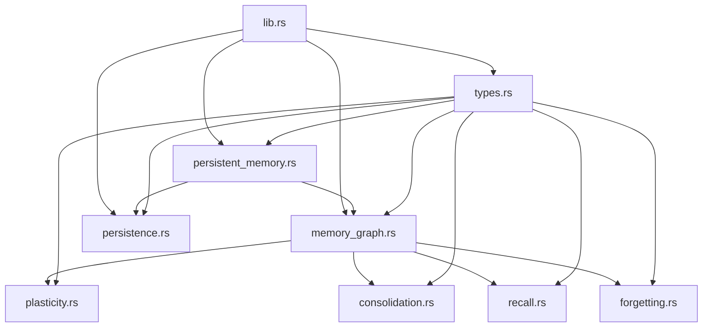

# 📚 LeafMind Developer Documentation

Welcome to the LeafMind codebase! This documentation will help you understand the architecture, design patterns, and implementation details so you can quickly start contributing new features.

## 📋 Table of Contents

1. [Architecture Overview](#architecture-overview)
2. [Module Structure](#module-structure)
3. [Core Concepts](#core-concepts)
4. [Data Flow](#data-flow)
5. [Key Algorithms](#key-algorithms)
6. [Persistence Architecture](#persistence-architecture)
7. [Adding New Features](#adding-new-features)
8. [Testing Strategy](#testing-strategy)
9. [Performance Considerations](#performance-considerations)

## 🏗️ Architecture Overview

LeafMind follows a modular, brain-inspired architecture with both in-memory and persistent storage:

```
┌─────────────────────────────────────────────────────────────┐
│                    LeafMind System                          │
├─────────────────────┬───────────────────┬───────────────────┤
│   Memory Graph      │   Plasticity      │   Consolidation   │
│   (Core Storage)    │   (Learning)      │   (Long-term)     │
├─────────────────────┼───────────────────┼───────────────────┤
│      Recall         │    Forgetting     │      Types        │
│   (Retrieval)       │   (Cleanup)       │   (Data Models)   │
├─────────────────────┼───────────────────┼───────────────────┤
│    Persistence      │ Persistent Memory │                   │
│   (RocksDB Store)   │  (Database API)   │                   │
└─────────────────────┴───────────────────┴───────────────────┘
```

### Design Principles

1. **Neuromorphic Design**: Models biological memory systems
2. **Thread Safety**: Concurrent access using `DashMap`
3. **Modularity**: Each brain function is a separate module
4. **Configurability**: Tunable parameters for different use cases
5. **Performance**: Efficient algorithms with automatic optimization
6. **Persistence**: Optional RocksDB-based storage for durability
7. **Hybrid Architecture**: Hot data in memory, cold data on disk

## 🗂️ Module Structure

```
src/
├── lib.rs              # Main library interface and re-exports
├── main.rs             # Demo application
├── types.rs            # Core data structures and types
├── memory_graph.rs     # Central memory storage and basic operations
├── plasticity.rs       # Synaptic plasticity (LTP/LTD) algorithms
├── consolidation.rs    # Hippocampus-to-cortex memory transfer
├── recall.rs           # Memory retrieval and associative recall
├── forgetting.rs       # Memory decay and cleanup mechanisms
├── persistence.rs      # RocksDB-based persistent storage engine
└── persistent_memory.rs # High-level persistent memory interface
```

### Module Dependencies



## 🧠 Core Concepts

### 1. Concept (`types.rs`)

Represents a single piece of information (like a neuron):

```rust
pub struct Concept {
    pub id: ConceptId,           // Unique identifier
    pub content: String,         // The actual information
    pub metadata: HashMap<String, String>, // Additional data
    pub created_at: DateTime<Utc>,         // Creation timestamp
    pub last_accessed: DateTime<Utc>,      // Last access time
    pub access_count: u64,                 // Usage frequency
}
```

**Key Methods:**
- `new()`: Create a new concept
- `access()`: Update access time and count
- `with_id()`: Create with specific ID

### 2. SynapticEdge (`types.rs`)

Represents a weighted connection between concepts (like a synapse):

```rust
pub struct SynapticEdge {
    pub from: ConceptId,              // Source concept
    pub to: ConceptId,                // Target concept
    pub weight: SynapticWeight,       // Connection strength (0.0-1.0)
    pub created_at: DateTime<Utc>,    // Creation time
    pub last_accessed: DateTime<Utc>, // Last activation
    pub activation_count: u64,        // Usage frequency
}
```

**Key Methods:**
- `activate()`: Strengthen the connection (LTP)
- `decay()`: Weaken the connection (LTD)
- `is_active()`: Check if above threshold

### 3. SynapticWeight (`types.rs`)

Manages connection strength with built-in constraints:

```rust
pub struct SynapticWeight(pub f64);

impl SynapticWeight {
    pub const MIN: f64 = 0.0;      // Minimum weight
    pub const MAX: f64 = 1.0;      // Maximum weight
    pub const INITIAL: f64 = 0.1;  // Starting weight
    pub const THRESHOLD: f64 = 0.01; // Active threshold
}
```

**Key Methods:**
- `strengthen()`: Apply LTP with asymptotic growth
- `weaken()`: Apply LTD with exponential decay
- `is_active()`: Check if above pruning threshold

### 4. MemoryGraph (`memory_graph.rs`)

The central nervous system of LeafMind:

```rust
pub struct MemoryGraph {
    pub(crate) concepts: DashMap<ConceptId, Concept>,
    pub(crate) short_term_edges: DashMap<(ConceptId, ConceptId), SynapticEdge>,
    pub(crate) long_term_edges: DashMap<(ConceptId, ConceptId), SynapticEdge>,
    pub(crate) working_memory: DashMap<ConceptId, DateTime<Utc>>,
    pub(crate) config: MemoryConfig,
    pub(crate) last_consolidation: Arc<RwLock<DateTime<Utc>>>,
}
```

**Memory Zones:**
- **Short-term**: Hippocampus-like temporary storage
- **Long-term**: Cortex-like permanent storage
- **Working**: Currently active concepts

## 🌊 Data Flow

### Learning Process
```
1. learn() -> Create Concept
2. associate() -> Create SynapticEdge in short_term_edges
3. access_concept() -> Update timestamps, add to working_memory
4. strengthen_concept_connections() -> Apply LTP to related edges
```

### Consolidation Process
```
1. consolidate_memory() -> Evaluate short-term connections
2. should_promote_to_long_term() -> Check promotion criteria
3. Move qualifying edges to long_term_edges
4. apply_memory_interference() -> Handle competing memories
5. Update consolidation timestamp
```

### Recall Process
```
1. recall() -> Start BFS from source concept
2. explore_connections() -> Follow edges in both memory zones
3. calculate relevance scores -> Weight by path length and strength
4. apply recency boost -> Favor recently accessed concepts
5. Return sorted results
```

### Forgetting Process
```
1. forget() -> Start cleanup cycle
2. prune_weak_connections() -> Remove below-threshold edges
3. apply_forgetting_curves() -> Time-based decay
4. remove_isolated_concepts() -> Clean up orphaned nodes
5. remove_unused_concepts() -> Age-based cleanup
```

## ⚙️ Key Algorithms

### 1. Long-Term Potentiation (LTP)
**Location**: `plasticity.rs` - `strengthen()`

```rust
// Asymptotic strengthening - approaches 1.0 but never reaches it
weight += learning_rate * (1.0 - weight)
```

**Purpose**: Strengthen frequently used connections
**Inspiration**: Biological synaptic strengthening

### 2. Long-Term Depression (LTD)
**Location**: `plasticity.rs` - `weaken()`

```rust
// Exponential decay
weight *= (1.0 - decay_rate)
if weight < threshold { weight = 0.0 }
```

**Purpose**: Weaken unused connections
**Inspiration**: Synaptic pruning in the brain

### 3. Hebbian Learning
**Location**: `plasticity.rs` - `hebbian_strengthening()`

```rust
// "Neurons that fire together, wire together"
for each pair in co_activated_concepts {
    strengthen_connection(pair.0, pair.1)
}
```

**Purpose**: Strengthen connections between simultaneously active concepts
**Inspiration**: Donald Hebb's learning rule

### 4. Memory Consolidation Criteria
**Location**: `consolidation.rs` - `should_promote_to_long_term()`

```rust
let criteria = [
    weight >= threshold,           // Strong enough
    activations >= min_count,      // Used frequently
    recent_access,                 // Accessed recently
    connection_age >= maturity,    // Existed long enough
    both_concepts_important,       // Both ends are valuable
];
// Promote if 3 out of 5 criteria met
```

**Purpose**: Decide which memories become permanent
**Inspiration**: Hippocampus-to-cortex transfer in sleep

### 5. Spreading Activation
**Location**: `recall.rs` - `spreading_activation_recall()`

```rust
// Iterative activation spreading
for iteration in 0..max_iterations {
    for concept in active_concepts {
        spread_activation_to_neighbors(concept, activation_decay)
    }
}
```

**Purpose**: Neural network-style memory retrieval
**Inspiration**: Activation spreading in neural networks

### 6. Ebbinghaus Forgetting Curve
**Location**: `forgetting.rs` - `apply_forgetting_curves()`

```rust
// Exponential forgetting over time
let retention_rate = (-days_since_access / (weight * time_constant)).exp()
let decay_amount = 1.0 - retention_rate
```

**Purpose**: Time-based natural forgetting
**Inspiration**: Hermann Ebbinghaus's memory research

## � Persistence Architecture

LeafMind provides both in-memory and persistent storage options through a layered architecture.

### 1. PersistentMemoryStore (`persistence.rs`)

The low-level storage engine using RocksDB:

```rust
pub struct PersistentMemoryStore {
    db: Arc<DB>,                                    // RocksDB instance
    cache: DashMap<StorageKey, Vec<u8>>,           // LRU cache
    config: PersistenceConfig,                      // Configuration
    stats: Arc<RwLock<StorageStats>>,              // Performance metrics
}
```

**Key Features:**
- **Batch Operations**: Efficient bulk writes and reads
- **Caching**: In-memory cache for frequently accessed data
- **Compression**: LZ4 compression for storage efficiency
- **Backup/Restore**: Full database backup and restore capabilities
- **Statistics**: Detailed performance monitoring

### 2. PersistentMemoryGraph (`persistent_memory.rs`)

High-level persistent memory interface:

```rust
pub struct PersistentMemoryGraph {
    memory_graph: MemoryGraph,                      // In-memory operations
    storage: PersistentMemoryStore,                 // Persistent storage
    auto_save_manager: Option<AutoSaveManager>,     // Background saving
    pending_changes: Arc<RwLock<HashSet<ConceptId>>>, // Dirty tracking
}
```

**Key Features:**
- **Async API**: Non-blocking database operations
- **Auto-save**: Configurable background persistence
- **Dirty Tracking**: Only saves modified data
- **Session Persistence**: Maintains state across restarts
- **Hybrid Storage**: Hot data in memory, cold data on disk

### 3. Storage Key System

Efficient key-value mapping for different data types:

```rust
#[derive(Debug, Clone, PartialEq, Eq, Hash)]
pub enum StorageKey {
    Concept(ConceptId),                            // Individual concepts
    ShortTermEdge(ConceptId, ConceptId),          // Short-term connections
    LongTermEdge(ConceptId, ConceptId),           // Long-term connections
    WorkingMemory(ConceptId),                     // Working memory entries
    Metadata(String),                             // System metadata
}
```

### 4. Factory Pattern for Configuration

Pre-configured setups for common use cases:

```rust
impl MemoryGraphFactory {
    pub fn in_memory() -> MemoryGraph { ... }              // RAM only
    pub fn persistent(path: &str) -> PersistentMemoryGraph { ... } // Full persistence
    pub fn cached_persistent(path: &str) -> PersistentMemoryGraph { ... } // Hybrid
    pub fn auto_save(path: &str, interval: Duration) -> PersistentMemoryGraph { ... } // Auto-save
}
```

### Persistence Data Flow

```
1. Operation -> PersistentMemoryGraph.method()
2. Update in-memory MemoryGraph
3. Mark changes in pending_changes (dirty tracking)
4. Auto-save or manual save() -> PersistentMemoryStore
5. Batch write to RocksDB with caching
6. Update statistics and clear dirty flags
```

### Storage Schema

```
Key Format:
- concept:{id} -> Concept (bincode serialized)
- st_edge:{from}:{to} -> SynapticEdge (short-term)
- lt_edge:{from}:{to} -> SynapticEdge (long-term)  
- working:{id} -> DateTime<Utc>
- meta:{key} -> String (configuration/metadata)
```

## �🔧 Adding New Features

### 1. Adding a New Plasticity Mechanism

**Step 1**: Add to `plasticity.rs`
```rust
impl MemoryGraph {
    pub fn your_new_mechanism(&self, parameters: YourParams) {
        // Implementation here
        for mut edge in self.short_term_edges.iter_mut() {
            // Modify edge weights based on your algorithm
        }
    }
}
```

**Step 2**: Add configuration parameters to `types.rs`
```rust
pub struct MemoryConfig {
    // existing fields...
    pub your_mechanism_rate: f64,
}
```

**Step 3**: Update `main.rs` demo and add tests

### 2. Adding a New Recall Method

**Step 1**: Add to `recall.rs`
```rust
impl MemoryGraph {
    pub fn your_recall_method(&self, query: YourQuery) -> Vec<RecallResult> {
        let mut results = Vec::new();
        // Your recall algorithm here
        results
    }
}
```

**Step 2**: Define query parameters
```rust
#[derive(Debug, Clone)]
pub struct YourQuery {
    pub your_param1: f64,
    pub your_param2: bool,
}
```

**Step 3**: Export in `lib.rs` and add demo usage

### 3. Adding New Memory Zone

**Step 1**: Add to `memory_graph.rs`
```rust
pub struct MemoryGraph {
    // existing fields...
    pub(crate) your_memory_zone: DashMap<ConceptId, YourData>,
}
```

**Step 2**: Update all relevant methods to handle the new zone

**Step 3**: Add transfer mechanisms between zones

### 4. Adding Metadata Processing

**Step 1**: Extend `Concept` metadata usage
```rust
impl Concept {
    pub fn add_your_metadata(&mut self, key: &str, value: String) {
        self.metadata.insert(key.to_string(), value);
    }
    
    pub fn get_your_metadata(&self, key: &str) -> Option<&String> {
        self.metadata.get(key)
    }
}
```

**Step 2**: Use metadata in recall/consolidation algorithms

### 5. Adding Persistence Features

**Step 1**: Extend the storage key system in `persistence.rs`
```rust
pub enum StorageKey {
    // existing variants...
    YourNewDataType(ConceptId, String),  // Add your key type
}

impl StorageKey {
    pub fn to_bytes(&self) -> Vec<u8> {
        match self {
            // existing matches...
            StorageKey::YourNewDataType(id, key) => {
                format!("your_data:{}:{}", id, key).into_bytes()
            }
        }
    }
}
```

**Step 2**: Add persistence methods to `PersistentMemoryGraph`
```rust
impl PersistentMemoryGraph {
    pub async fn store_your_data(&self, id: ConceptId, data: YourData) -> Result<()> {
        let key = StorageKey::YourNewDataType(id, "your_key".to_string());
        let value = bincode::serialize(&data)?;
        self.storage.store(key, value).await?;
        Ok(())
    }
    
    pub async fn load_your_data(&self, id: ConceptId) -> Result<Option<YourData>> {
        let key = StorageKey::YourNewDataType(id, "your_key".to_string());
        if let Some(value) = self.storage.load(&key).await? {
            let data = bincode::deserialize(&value)?;
            Ok(Some(data))
        } else {
            Ok(None)
        }
    }
}
```

**Step 3**: Add configuration options to `PersistenceConfig`
```rust
pub struct PersistenceConfig {
    // existing fields...
    pub your_feature_enabled: bool,
    pub your_cache_size: usize,
}
```

**Step 4**: Update the factory methods to support your feature

### 6. Adding Custom Serialization

**Step 1**: Implement Serde traits for your types
```rust
use serde::{Deserialize, Serialize};

#[derive(Debug, Clone, Serialize, Deserialize)]
pub struct YourCustomType {
    pub field1: String,
    pub field2: Vec<f64>,
}
```

**Step 2**: Add conversion methods if needed
```rust
impl YourCustomType {
    pub fn to_storage_format(&self) -> Vec<u8> {
        bincode::serialize(self).unwrap()
    }
    
    pub fn from_storage_format(data: &[u8]) -> Result<Self> {
        bincode::deserialize(data).map_err(Into::into)
    }
}
```

### 7. Performance Optimization

**Step 1**: Add custom caching for your data
```rust
pub struct YourCustomCache {
    cache: DashMap<YourKey, YourValue>,
    max_size: usize,
}

impl YourCustomCache {
    pub fn get_or_load<F>(&self, key: &YourKey, loader: F) -> Result<YourValue>
    where
        F: FnOnce() -> Result<YourValue>,
    {
        if let Some(value) = self.cache.get(key) {
            Ok(value.clone())
        } else {
            let value = loader()?;
            self.cache.insert(key.clone(), value.clone());
            Ok(value)
        }
    }
}
```

**Step 2**: Add batch operations for efficiency
```rust
impl PersistentMemoryGraph {
    pub async fn batch_store_your_data(&self, items: Vec<(YourKey, YourData)>) -> Result<()> {
        let mut batch = WriteBatch::default();
        for (key, data) in items {
            let storage_key = StorageKey::from(key);
            let value = bincode::serialize(&data)?;
            batch.put(storage_key.to_bytes(), value);
        }
        self.storage.write_batch(batch).await
    }
}
```

## 🧪 Testing Strategy

### Unit Tests Location
Each module has tests in the same file using `#[cfg(test)]`:

```rust
#[cfg(test)]
mod tests {
    use super::*;
    
    #[test]
    fn test_your_feature() {
        // Test implementation
    }
}
```

### Integration Tests
Main integration tests are in `src/lib.rs`:

```rust
#[test]
fn test_basic_memory_operations() {
    let memory = MemoryGraph::new_with_defaults();
    // Test complete workflows
}
```

### Test Categories

1. **Unit Tests**: Test individual functions
2. **Integration Tests**: Test module interactions  
3. **Property Tests**: Test invariants (e.g., weights stay in 0-1 range)
4. **Performance Tests**: Benchmark critical paths
5. **Regression Tests**: Prevent breaking changes

### Writing Good Tests

```rust
#[test]
fn test_ltp_strengthening() {
    let memory = MemoryGraph::new_with_defaults();
    let concept1 = memory.learn("test1".to_string());
    let concept2 = memory.learn("test2".to_string());
    
    // Create connection
    memory.associate(concept1.clone(), concept2.clone()).unwrap();
    
    // Get initial weight
    let initial_weight = /* get weight from edge */;
    
    // Apply LTP
    memory.apply_ltp_strengthening();
    
    // Verify strengthening
    let final_weight = /* get weight from edge */;
    assert!(final_weight > initial_weight);
}
```

## ⚡ Performance Considerations

### 1. Concurrent Access
- Uses `DashMap` for thread-safe, lock-free access
- Each memory zone can be accessed concurrently
- Read operations don't block each other

### 2. Memory Efficiency
- Automatic pruning of weak connections
- Configurable limits on memory zones
- Lazy evaluation where possible

### 3. Algorithmic Complexity
- **Concept lookup**: O(1) average case
- **Associative recall**: O(k * log n) where k = max path length
- **Consolidation**: O(n) where n = short-term connections
- **Forgetting**: O(n) where n = total connections

### 4. Optimization Opportunities

**Hot Paths to Optimize:**
1. `recall()` - Most frequently called
2. `access_concept()` - Called on every concept touch
3. `consolidate_memory()` - Expensive but less frequent
4. Connection iteration in plasticity methods

**Memory Optimizations:**
1. Consider connection pooling for frequently created edges
2. Batch updates for plasticity operations
3. Lazy deletion with periodic cleanup
4. Memory mapping for very large graphs

### 5. Monitoring and Profiling

Add performance counters:
```rust
pub struct PerformanceStats {
    pub recall_calls: u64,
    pub consolidation_time_ms: u64,
    pub average_recall_time_us: u64,
}
```

Use `tracing` for performance monitoring:
```rust
use tracing::{instrument, info};

#[instrument(skip(self))]
pub fn expensive_operation(&self) {
    // Implementation
    info!("Operation completed in {}ms", elapsed);
}
```

## 🚀 Development Workflow

### 1. Feature Development Process
1. **Design**: Document the biological inspiration and algorithm
2. **Interface**: Define public API in relevant module
3. **Implementation**: Write core logic with error handling
4. **Testing**: Add comprehensive tests
5. **Integration**: Update main demo and documentation
6. **Performance**: Profile and optimize if needed

### 2. Code Style Guidelines
- Follow Rust naming conventions
- Add comprehensive documentation for public APIs
- Use `tracing` for logging, not `println!`
- Handle errors gracefully with `Result<T, E>`
- Keep functions focused and modular

### 3. Pull Request Checklist
- [ ] Tests pass locally (`cargo test`)
- [ ] No compiler warnings (`cargo build`)
- [ ] Documentation updated
- [ ] Demo updated if relevant
- [ ] Performance impact considered
- [ ] Biological inspiration documented

## 🎯 Common Extension Points

### 1. New Learning Rules
Extend `plasticity.rs` with algorithms like:
- Spike-timing dependent plasticity (STDP)
- Metaplasticity (plasticity of plasticity)
- Homeostatic scaling

### 2. Advanced Recall Methods
Extend `recall.rs` with:
- Attention-based recall
- Context-dependent retrieval
- Semantic similarity using embeddings
- Temporal pattern matching

### 3. Memory Architectures
Add new memory systems:
- Episodic vs semantic memory separation
- Procedural memory for skill learning
- Emotional memory with affect weighting
- Spatial memory with location encoding

### 4. Biological Realism
Enhance with:
- Neurotransmitter simulation
- Circadian rhythm effects
- Stress hormone impacts on memory
- Age-related memory changes

---

This documentation should give you everything you need to understand and extend LeafMind. Happy coding! 🧠✨